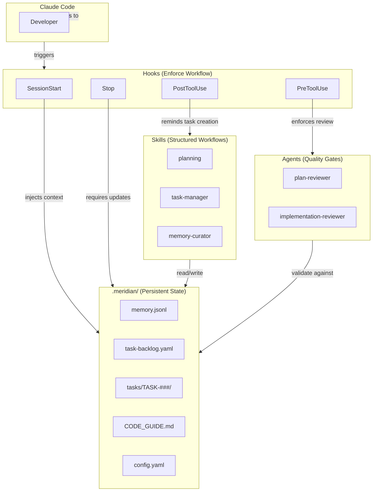
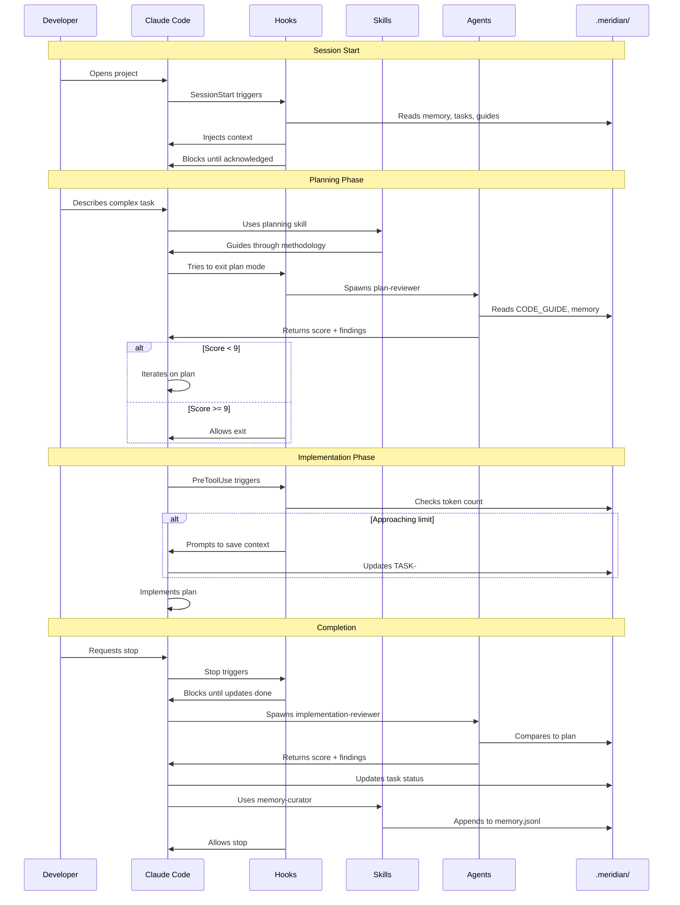

# Meridian

**Behavioral guardrails for Claude Code** — enforced workflows, persistent context, and quality gates for complex tasks.

**Current version:** `0.0.11` (2025-12-29) | [Changelog](CHANGELOG.md)

> If Meridian helps your work, please **star the repo** and share it.
> Follow updates: [X (@markmdev)](http://x.com/markmdev) • [LinkedIn](http://linkedin.com/in/markmdev)

---

## The Problem

Claude Code is powerful, but on complex tasks it struggles with:

| Problem | What happens |
|---------|--------------|
| **Context loss** | After compaction, Claude forgets decisions, requirements, and what it was working on |
| **No built-in memory** | Claude can't remember lessons learned — it repeats the same mistakes because it doesn't know it already made them |
| **Forgets prompt details** | With large context, Claude starts ignoring parts of your `CLAUDE.md` instructions |
| **Shallow planning** | Plans lack depth, miss integration steps, and break during implementation |
| **No task continuity** | When you return to a task next session, Claude doesn't know what was done, decided, or tried |

You can write instructions in `CLAUDE.md`, but with large context Claude starts forgetting details from the prompt.

---

## What Meridian Does

Meridian uses Claude Code's hooks system to enforce behaviors automatically:

| Capability | How it works |
|------------|--------------|
| **Context survives compaction** | Hooks re-inject memory, task state, guidelines, and your docs after every compaction |
| **Persistent memory** | Lessons learned, architectural decisions, and mistakes are saved to `memory.jsonl` — Claude reads them every session |
| **Task continuity** | Each task has a context file tracking what was done, decisions made, and next steps — Claude picks up where it left off |
| **Pre-compaction warning** | Monitors token usage and prompts Claude to save context before compaction happens |
| **Detailed plans that work** | Planning skill guides Claude through thorough discovery, design, and integration planning |
| **Quality gates** | Plan-reviewer and implementation-reviewer agents validate work before proceeding |
| **MCP integrations** | Context7 and DeepWiki provide up-to-date library docs and repository knowledge for planning and review |
| **Your custom docs injected** | Add your architecture docs, API references, etc. to `required-context-files.yaml` — they're injected every session |

**Your behavior doesn't change.** You talk to Claude the same way. Meridian works behind the scenes.

---

## When Meridian Shines

Meridian is designed for **large, complex, long-running tasks** where:
- Work spans multiple sessions
- Context loss would be costly
- Quality matters
- You want Claude to learn from past mistakes

For simple tasks (quick edits, one-off questions), Meridian won't help much — but it won't hurt either. It stays out of the way.

---

## Architecture



### How Components Work Together



---

## Quick Start

```bash
# Clone Meridian
git clone https://github.com/markmdev/meridian.git
cd meridian

# Copy to your project
cp -R .claude .meridian .mcp.json /path/to/your/project
cd /path/to/your/project

# Make scripts executable
find .claude -type f -name '*.py' -print0 | xargs -0 chmod +x

# (Optional) Configure project type
# Edit .meridian/config.yaml → project_type: hackathon|standard|production
```

Open your project in Claude Code. Hooks activate automatically, MCP servers connect.

---

## Why Not Just CLAUDE.md?

| | `CLAUDE.md` | Meridian |
|-|-------------|----------|
| **Large context** | Claude forgets prompt details as context grows | Hooks reinforce key behaviors throughout the session |
| **Memory** | None | `memory.jsonl` persists lessons across sessions |
| **Task continuity** | None — each session starts fresh | Context files track progress, decisions, next steps |
| **Quality gates** | None | Plan review + implementation review before proceeding |
| **Library docs** | Claude's training data (potentially outdated) | MCP servers provide current documentation |
| **Custom docs** | Must be read manually each session | Injected automatically via `required-context-files.yaml` |

`CLAUDE.md` is a static prompt. Meridian hooks actively enforce behaviors and inject context throughout the session.

---

## Components Deep Dive

<details>
<summary><strong>Hooks — Enforce Workflow</strong></summary>

Hooks are Python scripts triggered at Claude Code lifecycle events. They can inject context, block actions, or modify behavior.

| Hook | Trigger | What it does |
|------|---------|--------------|
| `claude-init.py` | SessionStart (startup) | Injects memory, tasks, CODE_GUIDE into context |
| `session-reload.py` | SessionStart (compact) | Re-injects context after compaction |
| `post-compact-guard.py` | PreToolUse | Blocks first tool until agent acknowledges context |
| `pre-compaction-sync.py` | PreToolUse | Warns when approaching token limit, prompts context save |
| `block-plan-agent.py` | PreToolUse (Task) | Redirects deprecated Plan agent to planning skill |
| `plan-review.py` | PreToolUse (ExitPlanMode) | Requires plan-reviewer before implementation |
| `plan-approval-reminder.py` | PostToolUse (ExitPlanMode) | Reminds to create task folder |
| `pre-stop-update.py` | Stop | Requires task/memory updates and implementation review |
| `startup-prune-completed-tasks.py` | SessionStart | Archives old completed tasks |
| `permission-auto-approver.py` | PermissionRequest | Auto-approves Meridian operations |
| `meridian-path-guard.py` | PermissionRequest | Blocks .meridian/.claude writes outside project root |
| `plan-mode-tracker.py` | UserPromptSubmit | Prompts planning skill when entering Plan mode |
| `task-file-tracker.py` | PostToolUse (Read/Write/Edit) | Tracks task file access for injection after compaction |
| `session-cleanup.py` | SessionEnd | Cleans up session state files |

All hooks live in `.claude/hooks/` and share utilities from `.claude/hooks/lib/config.py`.

</details>

<details>
<summary><strong>Skills — Structured Workflows</strong></summary>

Skills are reusable instruction sets that activate when invoked.

### Planning Skill

Guides Claude through comprehensive planning so plans don't break during implementation:
1. **Deep Discovery** — Spawn Explore subagents to understand the codebase before writing anything
2. **Design** — Choose approach, define target state, verify assumptions against actual code
3. **Decomposition** — Break into subtasks with clear dependencies
4. **Integration** — Explicitly plan how modules connect (mandatory for multi-module plans)

Plans describe **what and why**, not how. The plan-reviewer agent validates plans against the actual codebase before implementation begins.

### Task Manager Skill

Creates and manages task folders. Each task has a context file (`TASK-###-context.md`) that serves as the **single source of truth** for that work:
- What was done and what's left
- Key decisions and why they were made
- Problems encountered and how they were solved
- Links to plan and related files

**Why this matters:** When you return to a task (or Claude resumes after compaction), the context file tells Claude exactly where things stand. No re-explaining, no lost progress.

### Memory Curator Skill

Manages `memory.jsonl` via scripts (never edit manually):
```bash
# Add entry
python3 .claude/skills/memory-curator/scripts/add_memory_entry.py \
  --summary "Lesson learned about X" \
  --tags architecture,pattern \
  --links "TASK-042 src/service.ts"

# Edit entry
python3 .claude/skills/memory-curator/scripts/edit_memory_entry.py \
  --id mem-0042 --summary "Updated summary"

# Delete entry
python3 .claude/skills/memory-curator/scripts/delete_memory_entry.py \
  --id mem-0042
```

</details>

<details>
<summary><strong>Agents — Quality Gates</strong></summary>

Agents are specialized subagents that validate work.

### Plan Reviewer

Validates plans before implementation:
- Verifies file paths and API assumptions against codebase
- Checks for missing steps, dependencies, integration plan
- Uses Context7 and DeepWiki to verify library claims
- Returns score (must reach 9+ to proceed) + findings

### Implementation Reviewer

Validates implementations after completion:
- Compares actual code against plan
- Flags hardcoded values, TODOs, unused exports
- Checks integration (no orphaned modules)
- Returns score (must reach 9+ to ship) + findings

**Multi-Reviewer Strategy:** For large plans, spawn multiple focused reviewers in parallel — phase reviewers, integration reviewer, completeness reviewer, and code reviewer.

### Code Reviewer

Line-by-line review of all code changes:
- Reviews every changed line for bugs, security, performance
- Checks CODE_GUIDE compliance
- Handles different git states (feature branch, uncommitted, staged)
- Returns score (must reach 9+) + findings

</details>

<details>
<summary><strong>MCP Servers — External Knowledge</strong></summary>

MCP (Model Context Protocol) servers give Claude access to up-to-date external knowledge. Meridian includes two:

### Context7

Queries documentation for any public library. Claude uses this to:
- Verify library APIs exist and work as expected
- Find correct usage patterns and examples
- Check for deprecations or breaking changes

### DeepWiki

Asks questions about any public GitHub repository. Claude uses this to:
- Understand how external libraries work internally
- Verify integration patterns are correct
- Research best practices for specific tools

**Why MCPs matter:** Claude's training data has a cutoff date. When planning or reviewing, Claude can verify claims against current documentation instead of relying on potentially outdated knowledge.

**Configuration:** `.mcp.json` in project root:
```json
{
  "mcpServers": {
    "context7": {
      "type": "http",
      "url": "https://mcp.context7.com/mcp"
    },
    "deepwiki": {
      "type": "http",
      "url": "https://mcp.deepwiki.com/mcp"
    }
  }
}
```

</details>

<details>
<summary><strong>Configuration</strong></summary>

### Project Config (`.meridian/config.yaml`)

```yaml
# Project type → which CODE_GUIDE addon to load
project_type: standard  # hackathon | standard | production

# Quality gates
plan_review_enabled: true
implementation_review_enabled: true

# Context preservation
pre_compaction_sync_enabled: true
pre_compaction_sync_threshold: 150000  # tokens
```

### Required Context Files (`.meridian/required-context-files.yaml`)

```yaml
# Always injected
core:
  - .meridian/memory.jsonl
  - .meridian/task-backlog.yaml
  - .meridian/CODE_GUIDE.md
  - .meridian/prompts/agent-operating-manual.md

# Your custom docs (injected FIRST, before core files)
# Add architecture docs, API references, design specs — anything Claude should always know
user_provided_docs:
  - docs/architecture.md
  - docs/api-reference.md

# Auto-loaded based on project_type
project_type_addons:
  hackathon: .meridian/CODE_GUIDE_ADDON_HACKATHON.md
  production: .meridian/CODE_GUIDE_ADDON_PRODUCTION.md
```

**`user_provided_docs`**: Add any project-specific documentation here. These files are injected at the very top of context (before memory and core files), so Claude always has access to your architecture decisions, API contracts, or any other docs you want it to reference.

### CODE_GUIDE System

- **Baseline** (`CODE_GUIDE.md`) — Default standards for Next.js/React + Node/TS
- **Hackathon Addon** — Relaxes rules for fast prototypes
- **Production Addon** — Tightens rules for production systems

Precedence: Baseline → Project Type Addon

</details>

<details>
<summary><strong>File Structure</strong></summary>

```
your-project/
├── .mcp.json                   # MCP server configuration
├── .claude/
│   ├── settings.json          # Hook configuration
│   ├── hooks/
│   │   ├── lib/config.py      # Shared utilities
│   │   ├── claude-init.py     # Session start
│   │   ├── session-reload.py  # Post-compaction
│   │   ├── post-compact-guard.py
│   │   ├── pre-compaction-sync.py
│   │   ├── plan-review.py
│   │   ├── plan-approval-reminder.py
│   │   ├── pre-stop-update.py
│   │   ├── block-plan-agent.py
│   │   ├── startup-prune-completed-tasks.py
│   │   ├── permission-auto-approver.py
│   │   ├── meridian-path-guard.py
│   │   ├── plan-mode-tracker.py
│   │   ├── task-file-tracker.py
│   │   └── session-cleanup.py
│   ├── skills/
│   │   ├── planning/SKILL.md
│   │   ├── task-manager/
│   │   │   ├── SKILL.md
│   │   │   └── scripts/create-task.py
│   │   ├── memory-curator/
│   │   │   ├── SKILL.md
│   │   │   └── scripts/
│   │   │       ├── add_memory_entry.py
│   │   │       ├── edit_memory_entry.py
│   │   │       └── delete_memory_entry.py
│   │   └── claudemd-writer/SKILL.md
│   └── agents/
│       ├── plan-reviewer.md
│       ├── implementation-reviewer.md
│       └── code-reviewer.md
├── .meridian/
│   ├── config.yaml                   # Project configuration
│   ├── required-context-files.yaml   # What gets injected
│   ├── CODE_GUIDE.md                 # Baseline standards
│   ├── CODE_GUIDE_ADDON_HACKATHON.md # Relaxed rules for prototypes
│   ├── CODE_GUIDE_ADDON_PRODUCTION.md # Strict rules for production
│   ├── memory.jsonl                  # Persistent lessons/decisions
│   ├── task-backlog.yaml             # Task index
│   ├── tasks/
│   │   ├── TASK-000-template/        # Template for new tasks
│   │   ├── TASK-001/
│   │   │   └── TASK-001-context.md
│   │   └── archive/                  # Old completed tasks
│   └── prompts/
│       └── agent-operating-manual.md # Agent behavior instructions
└── your-code/
```

</details>

---

## FAQ

**Who is Meridian for?**

Anyone using Claude Code for complex, multi-session work. Solo developers and teams alike benefit from enforced workflows and persistent context.

**Does Meridian change how I interact with Claude?**

No. You talk to Claude the same way. Meridian works behind the scenes through hooks.

**What happens on simple tasks?**

Nothing. Hooks fire but don't block anything meaningful. The overhead is minimal.

**Can I customize the CODE_GUIDE?**

Yes. Edit `.meridian/CODE_GUIDE.md` to add project-specific rules. It's injected every session.

**Can I disable features?**

Yes. In `.meridian/config.yaml`:
```yaml
plan_review_enabled: false
implementation_review_enabled: false
pre_compaction_sync_enabled: false
```

**How is this different from subagents?**

Subagents don't share live context, re-read docs (token waste), and can't be resumed after interrupts. Meridian keeps Claude as the primary agent and injects context directly.

**What are the MCP servers for?**

Context7 and DeepWiki give Claude access to current library documentation. Claude's training data has a cutoff, so when it needs to verify an API exists or check usage patterns, it queries these servers instead of guessing.

---

## Contributing

PRs and issues welcome at [github.com/markmdev/meridian](https://github.com/markmdev/meridian)

**License:** MIT

---

## Star & Share

If Meridian improves your Claude Code sessions:

- **Star this repo** so others can find it
- Share your experience on [X (@markmdev)](http://x.com/markmdev) or [LinkedIn](http://linkedin.com/in/markmdev)
