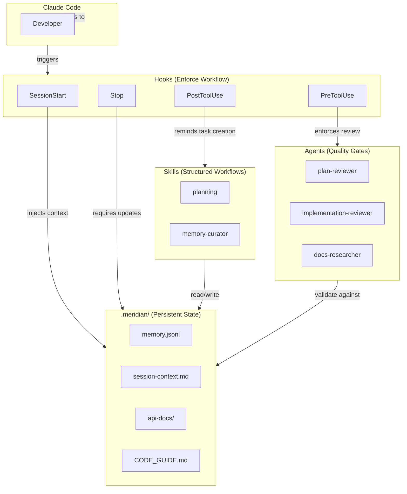

# Meridian

**Behavioral guardrails for Claude Code** — enforced workflows, persistent context, and quality gates for complex tasks.

**Current version:** `0.0.27` (2026-01-17) | [Changelog](CHANGELOG.md)

> If Meridian helps your work, please **star the repo** and share it.
> Follow updates: [X (@markmdev)](http://x.com/markmdev) • [LinkedIn](http://linkedin.com/in/markmdev)

---

## The Problem

Claude Code is powerful, but on complex tasks it struggles with:

| Problem | What happens |
|---------|--------------|
| **Context loss** | After compaction, Claude forgets decisions, requirements, and what it was working on |
| **No built-in memory** | Claude can't remember lessons learned — it repeats the same mistakes because it doesn't know it already made them |
| **Forgets prompt details** | With large context, Claude starts ignoring parts of your `CLAUDE.md` instructions |
| **Shallow planning** | Plans lack depth, miss integration steps, and break during implementation |
| **No task continuity** | When you return to a task next session, Claude doesn't know what was done, decided, or tried |

You can write instructions in `CLAUDE.md`, but with large context Claude starts forgetting details from the prompt.

---

## What Meridian Does

Meridian uses Claude Code's hooks system to enforce behaviors automatically:

| Capability | How it works |
|------------|--------------|
| **Context survives compaction** | Hooks re-inject memory, task state, guidelines, and your docs after every compaction |
| **Persistent memory** | Lessons learned, architectural decisions, and mistakes are saved to `memory.jsonl` — Claude reads them every session |
| **Session continuity** | Rolling `session-context.md` tracks decisions, discoveries, and context across sessions — Claude picks up where it left off |
| **Pre-compaction warning** | Monitors token usage and prompts Claude to save context before compaction happens |
| **Detailed plans that work** | Planning skill guides Claude through thorough discovery, design, and integration planning |
| **Quality gates** | Plan-reviewer and implementation-reviewer agents validate work before proceeding |
| **MCP integrations** | Context7 and DeepWiki provide up-to-date library docs and repository knowledge for planning and review |
| **Your custom docs injected** | Add your architecture docs, API references, etc. to `required-context-files.yaml` — they're injected every session |

**Your behavior doesn't change.** You talk to Claude the same way. Meridian works behind the scenes.

---

## When Meridian Shines

Meridian is designed for **large, complex, long-running tasks** where:
- Work spans multiple sessions
- Context loss would be costly
- Quality matters
- You want Claude to learn from past mistakes

For simple tasks (quick edits, one-off questions), Meridian won't help much — but it won't hurt either. It stays out of the way.

---

## Architecture



### How Components Work Together


---

## Quick Start

### One-line install (recommended)

```bash
cd /path/to/your/project
curl -fsSL https://raw.githubusercontent.com/markmdev/meridian/main/install.sh | bash
```

### Install specific version

```bash
curl -fsSL https://raw.githubusercontent.com/markmdev/meridian/main/install.sh | bash -s -- -v 0.0.27
```

### Update existing installation

```bash
# Same command — installer detects existing installation and updates
# Your memory.jsonl, session-context.md, and config are preserved
curl -fsSL https://raw.githubusercontent.com/markmdev/meridian/main/install.sh | bash
```

### Check installed version

```bash
./install.sh --check
# Or just: cat .meridian/.version
```

### Manual install

```bash
git clone https://github.com/markmdev/meridian.git
cp -R meridian/.claude meridian/.meridian meridian/.mcp.json /path/to/your/project
cd /path/to/your/project
find .claude -type f -name '*.py' -print0 | xargs -0 chmod +x
```

Open your project in Claude Code. Hooks activate automatically, MCP servers connect.

---

## Why Not Just CLAUDE.md?

| | `CLAUDE.md` | Meridian |
|-|-------------|----------|
| **Large context** | Claude forgets prompt details as context grows | Hooks reinforce key behaviors throughout the session |
| **Memory** | None | `memory.jsonl` persists lessons across sessions |
| **Task continuity** | None — each session starts fresh | Context files track progress, decisions, next steps |
| **Quality gates** | None | Plan review + implementation review before proceeding |
| **Library docs** | Claude's training data (potentially outdated) | MCP servers provide current documentation |
| **Custom docs** | Must be read manually each session | Injected automatically via `required-context-files.yaml` |

`CLAUDE.md` is a static prompt. Meridian hooks actively enforce behaviors and inject context throughout the session.

---

## Components Deep Dive

<details>
<summary><strong>Hooks — Enforce Workflow</strong></summary>

Hooks are Python scripts triggered at Claude Code lifecycle events. They can inject context, block actions, or modify behavior.

| Hook | Trigger | What it does |
|------|---------|--------------|
| `claude-init.py` | SessionStart (startup) | Injects memory, tasks, CODE_GUIDE into context |
| `session-reload.py` | SessionStart (compact) | Re-injects context after compaction |
| `post-compact-guard.py` | PreToolUse | Blocks first tool until agent acknowledges context |
| `pre-compaction-sync.py` | PreToolUse | Warns when approaching token limit, prompts context save |
| `block-plan-agent.py` | PreToolUse (Task) | Redirects deprecated Plan agent to planning skill |
| `plan-review.py` | PreToolUse (ExitPlanMode) | Requires plan-reviewer before implementation |
| `action-counter.py` | PostToolUse | Tracks actions for stop hook threshold |
| `periodic-reminder.py` | PostToolUse, UserPromptSubmit, SessionStart | Injects behavior reminders every N actions |
| `plan-approval-reminder.py` | PostToolUse (ExitPlanMode) | Reminds to create Pebble issues (if enabled) |
| `pre-stop-update.py` | Stop | Requires memory updates and implementation review |
| `permission-auto-approver.py` | PermissionRequest | Auto-approves Meridian operations |
| `meridian-path-guard.py` | PermissionRequest | Blocks .meridian/.claude writes outside project root |
| `plan-mode-tracker.py` | UserPromptSubmit | Prompts planning skill when entering Plan mode |
| `session-cleanup.py` | SessionEnd | Cleans up session state files |

All hooks live in `.claude/hooks/` and share utilities from `.claude/hooks/lib/config.py`.

</details>

<details>
<summary><strong>Skills — Structured Workflows</strong></summary>

Skills are reusable instruction sets that activate when invoked.

### Planning Skill

Guides Claude through comprehensive planning so plans don't break during implementation:
1. **Requirements Interview** — Up to 40 questions across multiple rounds to deeply understand the task
2. **Deep Discovery** — Use direct tools (Glob, Grep, Read) to research the codebase; Explore agents only for conceptual questions
3. **Design** — Choose approach, define target state, verify assumptions against actual code
4. **Decomposition** — Break into subtasks with clear dependencies
5. **Integration** — Explicitly plan how modules connect (mandatory for multi-module plans)
6. **Documentation** — Each phase must include CLAUDE.md and human docs steps (mandatory)

Plans describe **what and why**, not how. The plan-reviewer agent validates plans against the actual codebase before implementation begins.

### Memory Curator Skill

Manages `memory.jsonl` via scripts (never edit manually). Uses strict criteria:

**The critical test:** "If I delete this entry, will the agent make the same mistake again — or is the fix already in the code?"

- **Add**: Architectural patterns, data model gotchas, API limitations, cross-agent patterns
- **Don't add**: One-time bug fixes (code is fixed), SDK quirks (code handles it), agent behavior rules (belong in operating manual)

```bash
# Add entry
python3 .claude/skills/memory-curator/scripts/add_memory_entry.py \
  --summary "Lesson learned about X" \
  --tags architecture,pattern \
  --links "TASK-042 src/service.ts"

# Edit entry
python3 .claude/skills/memory-curator/scripts/edit_memory_entry.py \
  --id mem-0042 --summary "Updated summary"

# Delete entry
python3 .claude/skills/memory-curator/scripts/delete_memory_entry.py \
  --id mem-0042
```

### Prompt Writing Skill

General-purpose guidance for writing effective prompts for any AI system:
- **Remove redundancy** — Merge overlapping content, deduplicate examples
- **Remove noise** — Cut excessive dividers, wrapper tags, verbose explanations
- **Sharpen instructions** — Make them direct and actionable
- **Keep load-bearing content** — Workflow steps, quality criteria, rules that matter

Works for Claude Code artifacts (skills, agents, hooks) and any other AI prompts.

### CLAUDE.md Writer Skill

Guidance for writing effective CLAUDE.md files:
- Hierarchical injection (files at each directory level)
- "Less is more" principle — every line competes for attention
- Commands first, then key patterns
- What/How/Why structure

</details>

<details>
<summary><strong>Agents — Quality Gates</strong></summary>

Agents are specialized subagents that validate work. All reviewers use an **issue-based system** — no scores, just issues or no issues. Loop until all issues are resolved.

### Plan Reviewer

Validates plans before implementation:
- Reads `memory.jsonl` for domain knowledge before analysis
- Verifies file paths and API assumptions against codebase
- Checks for missing steps, dependencies, integration plan, documentation steps
- Uses Context7 and DeepWiki to verify library claims
- Trusts plan claims about packages/versions (user may have private access)
- Returns score (must reach 9+ to proceed) + findings

### Implementation Reviewer

Verifies every plan item was implemented:
- Extracts checklist of EVERY item from the plan
- Verifies each item individually (no skipping, no assumptions)
- Creates issues for incomplete items (Pebble issues or markdown file)
- Loop: fix issues → re-run → repeat until no issues

### Code Reviewer (CodeRabbit-style)

Deep code review with full context analysis:
1. Loads context (memory.jsonl, plan, CLAUDE.md)
2. Creates detailed walkthrough of each change (forcing function)
3. Generates sequence diagrams for complex flows (forcing function)
4. Finds real issues — logic bugs, data flow problems, pattern inconsistencies
5. Creates issues for findings (Pebble issues or markdown file)

Focuses on issues that actually matter, not checklist items or style preferences.

### Browser Verifier (experimental)

Manual QA using Claude for Chrome MCP:
- Extracts user-facing items from plan
- Actually uses the application in a browser to verify functionality
- Checks visual appearance (layout, styling, responsiveness)
- Tests user flows, form submissions, error states
- Creates issues for failures (Pebble issues or markdown file)

Requires Claude for Chrome browser extension.

### Docs Researcher

Researches external tools, APIs, and products:
- Uses Firecrawl to scrape current documentation from the web
- Builds comprehensive knowledge docs in `.meridian/api-docs/`
- Covers current versions, API operations, rate limits, best practices, gotchas
- Run before using any external library not already documented

**Strict rule:** No code using external APIs unless documented in api-docs. Planning skill has mandatory phase to verify/create docs.

### Feature Writer

Generates verification features for approved plans:
- Creates 5-20 testable acceptance criteria per phase (based on complexity)
- Each feature has concrete verification steps
- Supports any verification type: UI, API, CLI, Library, Config/Infra, Data
- Appends features to plan file in YAML format

### Pebble Scaffolder

Creates Pebble issue hierarchy from plans (when Pebble enabled):
- Reads plan with verification features
- Creates epic for overall plan
- Creates task per phase as children of epic
- Creates verification subtask per feature (steps in description)
- Adds dependencies between sequential phases
- Invoked automatically after plan approval

</details>

<details>
<summary><strong>MCP Servers — External Knowledge</strong></summary>

MCP (Model Context Protocol) servers give Claude access to up-to-date external knowledge. Meridian includes three:

### Context7

Queries documentation for any public library. Claude uses this to:
- Verify library APIs exist and work as expected
- Find correct usage patterns and examples
- Check for deprecations or breaking changes

### DeepWiki

Asks questions about any public GitHub repository. Claude uses this to:
- Understand how external libraries work internally
- Verify integration patterns are correct
- Research best practices for specific tools

### Firecrawl

Web scraping and search capabilities. Used by docs-researcher agent and reviewers to:
- Scrape current documentation from official sources
- Search for up-to-date API information
- Crawl documentation sites for comprehensive coverage

Requires `FIRECRAWL_API_KEY` environment variable.

**Why MCPs matter:** Claude's training data has a cutoff date. When planning or reviewing, Claude can verify claims against current documentation instead of relying on potentially outdated knowledge.

**Configuration:** `.mcp.json` in project root:
```json
{
  "mcpServers": {
    "context7": {
      "type": "http",
      "url": "https://mcp.context7.com/mcp"
    },
    "deepwiki": {
      "type": "http",
      "url": "https://mcp.deepwiki.com/mcp"
    },
    "firecrawl-mcp": {
      "command": "npx",
      "args": ["-y", "firecrawl-mcp"],
      "env": { "FIRECRAWL_API_KEY": "$FIRECRAWL_API_KEY" }
    }
  }
}
```

</details>

<details>
<summary><strong>Configuration</strong></summary>

### Project Config (`.meridian/config.yaml`)

```yaml
# Project type → which CODE_GUIDE addon to load
project_type: standard  # hackathon | standard | production

# Quality gates
plan_review_enabled: true
implementation_review_enabled: true

# Context preservation
pre_compaction_sync_enabled: true
pre_compaction_sync_threshold: 150000  # tokens

# Stop hook behavior
stop_hook_min_actions: 10  # Skip stop hook if < N actions since last user input
```

### Required Context Files (`.meridian/required-context-files.yaml`)

```yaml
# Always injected
core:
  - .meridian/memory.jsonl
  - .meridian/CODE_GUIDE.md
  - .meridian/prompts/agent-operating-manual.md

# Your custom docs (injected FIRST, before core files)
# Add architecture docs, API references, design specs — anything Claude should always know
user_provided_docs:
  - docs/architecture.md
  - docs/api-reference.md

# Auto-loaded based on project_type
project_type_addons:
  hackathon: .meridian/CODE_GUIDE_ADDON_HACKATHON.md
  production: .meridian/CODE_GUIDE_ADDON_PRODUCTION.md
```

**`user_provided_docs`**: Add any project-specific documentation here. These files are injected at the very top of context (before memory and core files), so Claude always has access to your architecture decisions, API contracts, or any other docs you want it to reference.

### CODE_GUIDE System

- **Baseline** (`CODE_GUIDE.md`) — Default standards for Next.js/React + Node/TS
- **Hackathon Addon** — Relaxes rules for fast prototypes
- **Production Addon** — Tightens rules for production systems

Precedence: Baseline → Project Type Addon

</details>

<details>
<summary><strong>File Structure</strong></summary>

```
your-project/
├── .mcp.json                   # MCP server configuration
├── .claude/
│   ├── settings.json          # Hook configuration
│   ├── hooks/
│   │   ├── lib/config.py      # Shared utilities
│   │   ├── claude-init.py     # Session start
│   │   ├── session-reload.py  # Post-compaction
│   │   ├── post-compact-guard.py
│   │   ├── pre-compaction-sync.py
│   │   ├── plan-review.py
│   │   ├── plan-approval-reminder.py
│   │   ├── pre-stop-update.py
│   │   ├── block-plan-agent.py
│   │   ├── action-counter.py  # Tracks actions for stop hook
│   │   ├── periodic-reminder.py  # Injects reminders every N messages
│   │   ├── permission-auto-approver.py
│   │   ├── meridian-path-guard.py
│   │   ├── plan-mode-tracker.py
│   │   └── session-cleanup.py
│   ├── commands/
│   │   ├── work-until.md        # Start work-until loop
│   │   └── coderabbit-review.md # CodeRabbit review cycle handler
│   ├── skills/
│   │   ├── planning/SKILL.md
│   │   ├── memory-curator/
│   │   │   ├── SKILL.md
│   │   │   └── scripts/
│   │   │       ├── add_memory_entry.py
│   │   │       ├── edit_memory_entry.py
│   │   │       └── delete_memory_entry.py
│   │   ├── prompt-writing/SKILL.md
│   │   └── claudemd-writer/SKILL.md
│   └── agents/
│       ├── plan-reviewer.md
│       ├── implementation-reviewer.md
│       ├── code-reviewer.md
│       ├── browser-verifier.md
│       ├── docs-researcher.md
│       ├── feature-writer.md
│       └── pebble-scaffolder.md
├── .meridian/
│   ├── config.yaml                   # Project configuration
│   ├── required-context-files.yaml   # What gets injected
│   ├── session-context.md            # Rolling context (always injected)
│   ├── worktree-context.md           # Shared context across git worktrees
│   ├── CODE_GUIDE.md                 # Baseline standards
│   ├── CODE_GUIDE_ADDON_HACKATHON.md # Relaxed rules for prototypes
│   ├── CODE_GUIDE_ADDON_PRODUCTION.md # Strict rules for production
│   ├── memory.jsonl                  # Persistent lessons/decisions
│   ├── api-docs/                     # External API documentation
│   │   └── INDEX.md                  # Index of documented APIs
│   ├── .state/                       # Ephemeral hook state (gitignored)
│   └── prompts/
│       └── agent-operating-manual.md # Agent behavior instructions
└── your-code/
```

</details>

---

## Work-Until Loop

The `/work-until` command creates an iterative loop where Claude keeps working on a task until a completion condition is met.

### Usage

```bash
# Basic: work until phrase is true
/work-until Fix all failing tests --completion-phrase "All tests pass"

# With iteration limit
/work-until Implement auth feature --completion-phrase "Feature complete" --max-iterations 10

# Just iteration limit (no phrase)
/work-until Refactor the API layer --max-iterations 5
```

### How It Works

1. **Start**: `/work-until` creates a loop state file with your task
2. **Work**: Claude works on the task normally
3. **Stop blocked**: When Claude tries to stop, the hook intercepts
4. **Check completion**: Hook looks for `<complete>PHRASE</complete>` in output
5. **Continue or exit**:
   - If phrase found (and TRUE) → loop ends
   - If max iterations reached → loop ends
   - Otherwise → task is resent, Claude continues

### Key Points

- **Session context preserves history**: Between iterations, Claude writes to `session-context.md`, so it knows what was tried
- **Normal stop checks still run**: Memory, session context, tests/lint/build — all enforced each iteration
- **Completion phrase must be TRUE**: Claude cannot lie to escape the loop
- **Monitor progress**: `cat .meridian/.state/loop-state` shows current iteration

### Example Flow

```
You: /work-until Fix the auth bug --completion-phrase "All auth tests pass" --max-iterations 5

Claude: [Works on fix, runs tests, some fail]
Claude: [Tries to stop]
→ Hook blocks: "Iteration 2 of 5 — continue working"

Claude: [Reads session-context, sees what was tried]
Claude: [Fixes another issue, runs tests, all pass]
Claude: <complete>All auth tests pass</complete>
→ Hook allows stop: "✅ Completion phrase detected"
```

---

## FAQ

**Who is Meridian for?**

Anyone using Claude Code for complex, multi-session work. Solo developers and teams alike benefit from enforced workflows and persistent context.

**Does Meridian change how I interact with Claude?**

No. You talk to Claude the same way. Meridian works behind the scenes through hooks.

**What happens on simple tasks?**

Nothing. Hooks fire but don't block anything meaningful. The overhead is minimal.

**Can I customize the CODE_GUIDE?**

Yes. Edit `.meridian/CODE_GUIDE.md` to add project-specific rules. It's injected every session.

**Can I disable features?**

Yes. In `.meridian/config.yaml`:
```yaml
plan_review_enabled: false
implementation_review_enabled: false
pre_compaction_sync_enabled: false
```

**How is this different from subagents?**

Subagents don't share live context, re-read docs (token waste), and can't be resumed after interrupts. Meridian keeps Claude as the primary agent and injects context directly.

**What are the MCP servers for?**

Context7 and DeepWiki give Claude access to current library documentation. Claude's training data has a cutoff, so when it needs to verify an API exists or check usage patterns, it queries these servers instead of guessing.

---

## Contributing

PRs and issues welcome at [github.com/markmdev/meridian](https://github.com/markmdev/meridian)

**License:** MIT

---

## Star & Share

If Meridian improves your Claude Code sessions:

- **Star this repo** so others can find it
- Share your experience on [X (@markmdev)](http://x.com/markmdev) or [LinkedIn](http://linkedin.com/in/markmdev)
